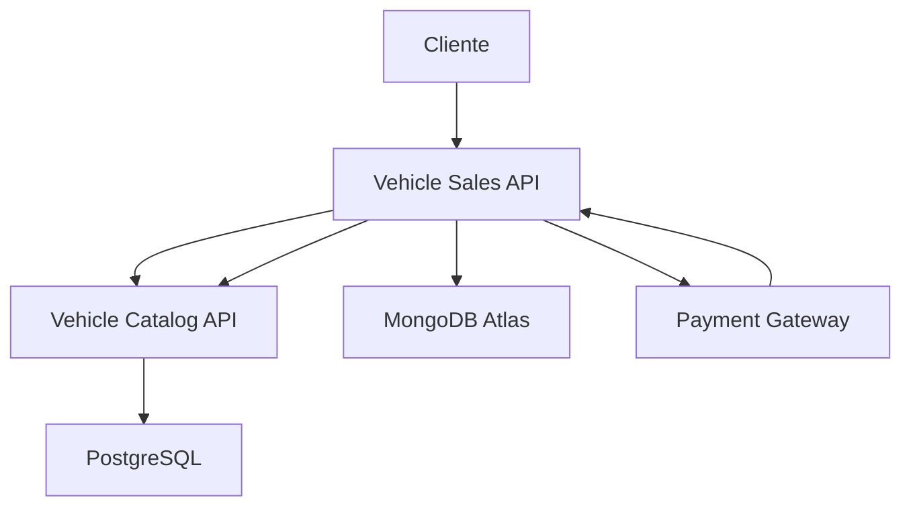

# 🚗 Vehicle Resale API
## Clean Architecture & Kubernetes Implementation

---

**Sistema de microservices em .NET 8 implementando Clean Architecture e princípios SOLID para gerenciamento de catálogo de veículos e processamento de vendas, com infraestrutura completa utilizando bancos SQL (PostgreSQL) e NoSQL (MongoDB Atlas), Docker e Kubernetes.**

---

## 🔗 Links Principais

### 📂 Repositórios GitHub
**Vehicle Sales API:** https://github.com/ohntrebor/vehicle-sales  
**Vehicle Catalog API:** https://github.com/ohntrebor/vehicle-catalog

### 🎥 Vídeo Demonstrativo
**https://www.youtube.com/watch?v=LKEupUM92_Q (16 min)**

---

## 🏗️ Arquitetura do Sistema

### 🔄 Microservices
- **Vehicle Catalog API:** Gerenciamento de catálogo de veículos (PostgreSQL)
- **Vehicle Sales API:** Processamento de vendas e pagamentos (MongoDB Atlas)
- **Integração:** Comunicação via HTTP entre serviços

### 🎯 Clean Architecture (Ambos os Serviços)
- **Domain:** Entidades, Value Objects, Interfaces
- **Application:** Use Cases, DTOs, Validações
- **Infrastructure:** Persistência, Repositórios, Serviços Externos
- **Presentation:** Controllers, API, Middlewares

### ⚖️ Princípios SOLID
- **S:** Single Responsibility Principle
- **O:** Open/Closed Principle
- **L:** Liskov Substitution Principle
- **I:** Interface Segregation Principle
- **D:** Dependency Inversion Principle

---

## 🛠️ Stack Tecnológico

### 🎯 Backend
- **.NET 8** - Framework principal
- **Entity Framework Core** - ORM para PostgreSQL
- **MongoDB Driver** - Acesso ao MongoDB Atlas
- **MediatR** - CQRS pattern
- **AutoMapper** - Mapeamento de objetos
- **FluentValidation** - Validação de dados

### 🗄️ Bancos de Dados
- **PostgreSQL** - Catálogo de veículos (relacional)
- **MongoDB Atlas** - Vendas e transações (documento)

### 🚀 Infraestrutura
- **Docker & Docker Compose** - Containerização
- **Kubernetes** - Orquestração de containers
- **Minikube** - Cluster local para desenvolvimento
- **Health Checks** - Monitoramento de saúde

---

## 🚀 Execução Local

### 🐳 Docker Compose (Recomendado)
```bash
# Clone os repositórios
git clone https://github.com/ohntrebor/vehicle-sales
git clone https://github.com/ohntrebor/vehicle-catalog

# Execute o sistema completo
cd vehicle-sales
docker compose up -d --build
```

**Acessos:**
- **Vehicle Catalog API:** http://localhost:5000/swagger
- **Vehicle Sales API:** http://localhost:5001/swagger
- **MongoDB Express:** http://localhost:8081

### ☸️ Kubernetes com Minikube
```bash
# Setup automático completo
cd vehicle-sales
make k8s-full-deploy
```

**Acessos:**
- **Vehicle Catalog API:** http://localhost:5000
- **Vehicle Sales API:** http://localhost:9000/swagger

### 💻 Desenvolvimento Local
```bash
# Vehicle Catalog API
cd vehicle-catalog
dotnet restore
dotnet run --project VehicleCatalog.API

# Vehicle Sales API  
cd vehicle-sales
dotnet restore
dotnet run --project VehicleSales.API
```

---

## 🧩 Funcionalidades

### 📊 Vehicle Catalog API
- ✅ **CRUD de Veículos** - Cadastro, edição, consulta, exclusão
- ✅ **Busca Avançada** - Filtros por marca, modelo, preço, ano
- ✅ **Gestão de Status** - Disponível, vendido, reservado
- ✅ **Notificações** - Recebe webhooks de vendas

### 💰 Vehicle Sales API
- ✅ **Consulta de Catálogo** - Proxy para Vehicle Catalog API
- ✅ **Registro de Vendas** - Processamento de transações
- ✅ **Webhook de Pagamento** - Integração com gateway
- ✅ **Histórico de Vendas** - Auditoria completa

---

## 🔄 Fluxo de Integração



1. **Consulta de Veículos** - Sales API → Catalog API
2. **Registro de Venda** - Dados salvos no MongoDB Atlas
3. **Webhook de Pagamento** - Gateway → Sales API
4. **Notificação de Venda** - Sales API → Catalog API
5. **Atualização de Status** - Catalog API → PostgreSQL

---

## 📋 Endpoints Principais

### Vehicle Catalog API
| Método | Endpoint | Descrição |
|--------|----------|-----------|
| GET | `/api/vehicles` | Listar veículos |
| POST | `/api/vehicles` | Cadastrar veículo |
| PUT | `/api/vehicles/{id}` | Atualizar veículo |
| DELETE | `/api/vehicles/{id}` | Remover veículo |
| GET | `/api/vehicles/search` | Busca com filtros |

### Vehicle Sales API
| Método | Endpoint | Descrição |
|--------|----------|-----------|
| GET | `/api/catalog/vehicles` | Consultar catálogo |
| POST | `/api/sales` | Registrar venda |
| GET | `/api/sales` | Listar vendas |
| POST | `/api/sales/payment-webhook` | Webhook pagamento |

---

## 🔒 Segurança & Qualidade

### 🛡️ Segurança
- ✅ **HTTPS** - Comunicação criptografada
- ✅ **Secrets** - Gerenciamento via Kubernetes
- ✅ **Validação** - FluentValidation em todas as entradas
- ✅ **CORS** - Configurado adequadamente

### 📊 Monitoramento
- ✅ **Health Checks** - `/health`, `/health/live`, `/health/ready`
- ✅ **Logging** - Estruturado com Serilog
- ✅ **Métricas** - Prometheus ready
- ✅ **Observabilidade** - Traces distribuídos

---

## 📈 Performance

### ⚡ Benchmarks
- **Response Time:** < 200ms (consultas)
- **Throughput:** 100+ req/s por instância
- **Disponibilidade:** 99.9% com múltiplas réplicas
- **Auto-scaling:** Baseado em CPU/Memória

### 🔧 Otimizações
- **Connection Pooling** - PostgreSQL e MongoDB
- **Async/Await** - Programação assíncrona
- **Caching** - Em memória para consultas frequentes
- **Lazy Loading** - Entity Framework otimizado

---

## 🧪 Testes

### 📋 Cobertura
- **Unit Tests** - Domínio e Application
- **Integration Tests** - Controllers e Repositories
- **Health Check Tests** - Monitoramento
- **Load Tests** - Performance e stress

### 🔄 CI/CD
- **GitHub Actions** - Build e testes automatizados
- **Docker Registry** - Imagens versionadas
- **Kubernetes Deploy** - Rolling updates
- **Sonarqube** - Análise de código

---

## 👥 Autor

**Robert A. dos Anjos**
- **Email:** robert.ads.anjos@gmail.com
- **GitHub:** @ohntrebor
- **LinkedIn:** [Robert dos Anjos](https://linkedin.com/in/robert-dos-anjos)

---

## 📞 Suporte Técnico

Para suporte, dúvidas ou contribuições:
- **Email:** robert.ads.anjos@gmail.com
- **Issues:** GitHub Issues nos repositórios
- **Documentation:** README.md em cada repositório

---

*Sistema completo de revenda de veículos desenvolvido com foco em arquitetura limpa, escalabilidade e boas práticas de desenvolvimento.*